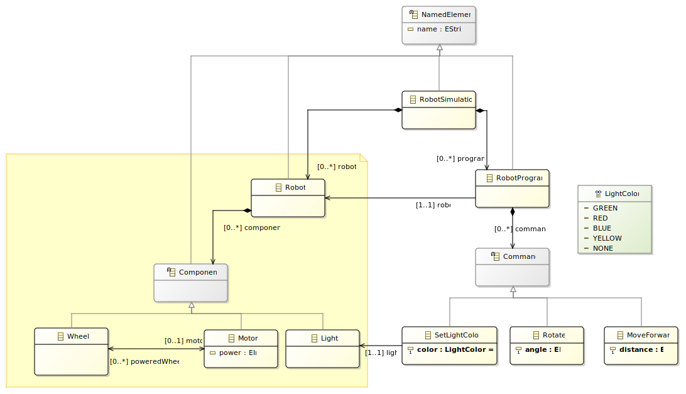
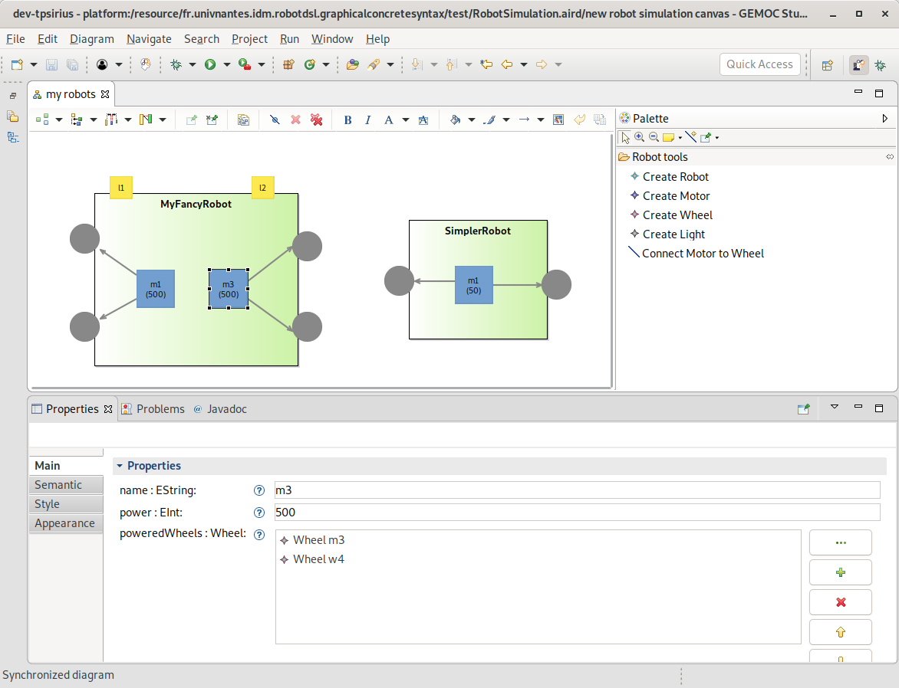

:sectnums:

:toc:

# TP IDM − Définir une syntaxe concrète graphique

Dans un précédent TP, nous avons défini à l'aide d'Xtext une syntaxe concrète textuelle pour un petit langage jouet appelé langage RobotDSL.
Cette syntaxe permet à des non-programmeurs de facilement créer des modèles RobotDSLs, à savoir des robots et des programmes controllant des robots.

*Dans ce TP*, nous allons définir une seconde syntaxe concrète pour une sous-partie d'une variante de RobotDSL.
Mais au lieu de définir une syntaxe concrète textuelle à l'aide d'une grammaire, nous allons définir une syntaxe concrète dite _graphique_.
Pour ce faire, nous allons définir un ensemble pertinent de formes graphiques (ronds, rectangles, connecteurs, etc.), et nous allons associer ces formes graphiques aux concepts de notre langage (ici: _Robot, Motor, Light_, etc.) pour pouvoir ainsi afficher et éditer graphiquement des modèles.

## Préparation d'Eclipse

1. Menu _Help → Eclipse Marketplace_,
2. Installer _EcoreTools_.
3. Installer _Sirius_.

NOTE: Préférez l'utilisation d'un Eclipse récent, par exemple _Eclipse Modeling Tools_ (qui comprend déjà EcoreTools) disponible sur https://www.eclipse.org/downloads/packages/.

## Énoncé

### Petit changement à RobotDSL

Pour rendre ce TP un peu plus intéressant, un petit ajout a été fait à la syntaxe abstraite, avec l'introduction du concept _Wheel_ représentant les roues pouvant avoir un robot.
Une _Wheel_ est reliée à un _Motor_ capable de la faire tourner.

NOTE: Pour ce TP on se concentrera sur la partie _Robot_ du métamodèle (en jaune dans le diagramme ci-dessous), et on ignorera la partie _RobotProgram_.

Le métamodèle RobotDSL considéré est donc le suivant :

### Spécification de la syntaxe graphique souhaitée

On souhaite pouvoir représenter et éditer des éléments _Robot_ sous une forme graphique simple.
On ne souhaite pas représenter des éléments  _RobotProgram_, pour lesquels la syntaxe textuelle définie précédemment est déjà bien adaptée.

En une image, le résultat visé en terme de syntaxe et d'IDE est le suivant :

Plus précisément, voici ce qu'on souhaite pour la syntaxe concrète :

* Un élément _RobotSimulation_ n'est pas directement représenté, si ce n'est par un canevas blanc sur lequel sont représentés tous les éléments _Robot_ qu'il contient.
* Un élément _Robot_ apparait sous la forme d'un rectangle vert, avec son nom écrit en gras.
* Un élément _Motor_ apparait sous la forme d'un carré bleu de taille fixe, avec son nom et sa puissance écrite entre parenthèses et à la ligne, positionné à l'intérieur du rectangle qui représente le _Robot_ parent.
* Un élément _Light_ apparait sous la forme d'un carré jaune de taille fixe, avec son nom au centre, positionné à la bordure du rectangle qui représente le _Robot_ parent.
* Un élément _Wheel_ apparait sous la forme d'un disque gris de taille fixe, sans nom d'affiché _mais_ avec un tooltip affichant le nom de l'élément quand le curseur est positionné dessus, et positionné à la bordure du rectangle qui représente le _Robot_ parent.
* La connection entre un élément _Motor_ et un élément _Wheel_ se représente par une flèche simple.

En outre, on souhaite les fonctionnalités d'édition suivantes :

* Un outil de création d'élément _Robot_.
* Un outil de création d'élément _Motor_.
* Un outil de création d'élément _Light_.
* Un outil de création d'élément _Wheel_.
* Un outil de création de lien entre un élément _Motor_ et un élément _Wheel_.

### Travail à effectuer

*Question 1.* Réalisez la syntaxe concrète graphique sous la forme d'un fichier `.odesign` contenu dans un projet de type _Viewpoint Specification Project_. Pour se lancer :

** Faire _New → Other… → Viewpoint Specification Project_.
** Ouvrir le fichier `.odesign` contenu dans le répertoire `description`.
** Faire un clic droit sur le _viewpoint_ et faire _New Representation_→_Diagram Description_
** Faire un clic droit n'importe où dans l'éditeur du `.odesign` et faire _Show Properties View_.
** Sélectionner le _diagram description_ nouvellement créé
** Aller dans l'onglet _Metamodels_ de la _Properties View_ nouvellement apparue, cliquer sur _Add from workspace_ et aller importez la syntaxe abstraite (ie. le métamodèle) de RobotDSL.
** Aller dans l'onglet _General_ et dans le champ _Domain Class_ utilisez l'auto-complétion pour aller chercher la métaclasse _RobotSimulation_. 
Cela signifie que désormais l'élément de base de votre syntaxe concrète (ie. le canevas blanc) reprénte un élement `RobotSimulation` du modèle.

Voilà, vous avez désormais un projet de syntaxe concrète de prêt, et qui est connecté à la syntaxe abstraite. 
Il vous reste à créer les formes graphiques, et à les relier (_mapping_) aux concepts de votre syntaxe abstraite :).

[IMPORTANT] 
====  
Pour tester votre syntaxe au fur et à mesure que vous avancez, un modèle RobotDSL de test vous est fourni (celui utilisé pour le screenshot montré plus haut).
Il se trouve dans le projet `fr.univnantes.idm.robotdsl.examples` sous le nom `example1.xmi`, mais ne possède pas de représentation en syntaxe concrète.

Pour initialiser une représentation graphique (vide) de ce modèle : Clic droit sur le fichier → _New → Representations File_.
Choisissez le répertoire contenant le modèle que vous voulez afficher graphiquement (ici, le répertoire avec `example1.xmi`).
Puis ouvrez le fichier `.aird` créé, sélectionnez le modèle dans la vue de gauche, puis votre _diagram description_ (ie. votre syntaxe concrète) dans la vue du milieu, et faites _New_ à droite.

Vous êtes alors face à un canevas, il se mettra à jour dynamiquement avec les éléments du modèle `example1.xmi` au fur et à mesure que vous définirez leur représentation graphique au sein du `.odesign`.
==== 

*Question 2.* Toujours au sein du `.odesign`, ajoutez la palette d'outils souhaitée pour pouvoir créer et modifier des modèles.

*Question 3.* Ajoutez la fonctionnalité suivantes à vos outils de création d'élément : lorsqu'un élément est créé (eg. un élément _Motor_), il lui est automatiquement donné un nom par défaut suffixé par un entier qui incrémente à chaque nouvel élement (eg. _m1, m2, m3_, etc.).

Pour cela, faites usage de l'opération _Set_ et écrivez une _Value Expression_ qui effectue cette tâche.
